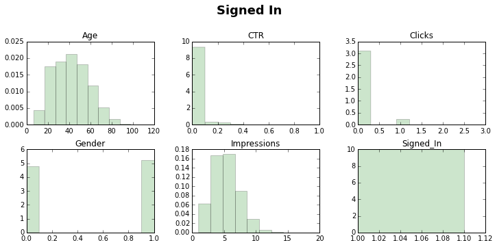
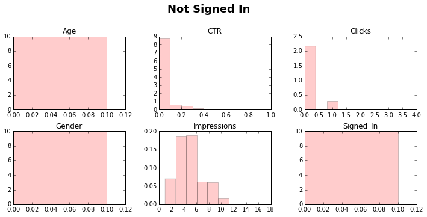

##Part 1: Hypothesis testing recap
Include the answers in ``morning_answers.md``


1. State which test should be used for the following scenarios. Explain your
   choice.

   (**Estimated Time: 5 mins**)

   a. Do workers who take more than 3 weeks of holiday more likely to make
      a typo in their reports?

   b. Do rats living in the artic have a higher motality rate?


2. A study looked at the incidence of hospitalization for heart failure in Ohio,
   in 12 groups of patients defined by their astrological sign (based on their
   birthday). People born under the sign of Pisces have the highest incidence of
   heart failure. The researchers then performed a z-test compare the incidence
   of heart failure under Pisces with the incidence of heart failure among all
   other signs. The p-value is 0.026. What is the problem with concluding
   people born under the sign of Pisces have higher incidence of heart failure
   at significance level of 0.05. How would you adjust the p value to reach
   an alternative conclusion.

   (**Estimated Time: 5 mins**)


##Part 2: Analyzing Click Through Rate
Include the word answers for ``1,4,5,6,8`` in ``morning_answers.md``

For the code, you may use an ipython notebook to get started with.

_**Please download your code into**_ ``morning.py``

We will use hypothesis testing to analyze **Click Through Rate (CTR)** on the New York Times website.
CTR is defined as the number of clicks the user make per impression that is made upon the user.
We are going to determine if there is statistically significant difference between the mean CTR of
the following groups:
```
1. Signed in users v.s. Not signed in users
2. Male v.s. Female
3. Each of 7 age groups against each other (7 choose 2 = 21 tests)
```
<br>
```python
#imports
 import pandas as pd
 import matplotlib.pyplot as plt
 import scipy.stats as scs
 from itertools import combinations
 %matplotlib inline
```
1. Calculate the p value adjusted for multiple testing at 0.05 significance level.

   (**Estimated Time: 2 mins**)

   ```python
    # significance adjusted for multiple testing
    alpha = 0.05 / 23
   ```

2. Load ``data/nyt1.csv`` in a pandas dataframe.

   Use ``data.info()`` to make sure the datatypes are valid and there are no null values.
   This data has been cleaned for you, but generally it is good practice to check for those.

   (**Estimated Time: 2 mins**)

   ```python
   data = pd.read_csv('data/nyt1.csv')

   data.info()

   <class 'pandas.core.frame.DataFrame'>
    Int64Index: 458441 entries, 0 to 458440
    Data columns (total 5 columns):
    Age            458441 non-null int64
    Gender         458441 non-null int64
    Impressions    458441 non-null int64
    Clicks         458441 non-null int64
    Signed_In      458441 non-null int64
    dtypes: int64(5)
   ```

3. Make a new column ``CTR`` using the ``Impressions`` and the ``Clicks`` columns.
   Remember to remove the rows with ``0`` impressions.

   ```python
   data = data[data['Impressions'] != 0]
   data['CTR'] = data['Clicks'] / data['Impressions'].astype(float)
   ```

   (**Estimated Time: 5 mins**)

4. Plot the distribution of each column in the dataframe. Do that using ``data.hist()``.
   Check out the argments you can use with the function
   [here](http://pandas.pydata.org/pandas-docs/stable/generated/pandas.DataFrame.hist.html).
   Set the ``figsize=(12,5)`` to make sure the graph is readable.

   (**Estimated Time: 5 mins**)

    ```python
    def plot_hist(df, title, color):
        df.hist(figsize=(12, 5), grid=False, normed=True, color=color, alpha=.2)
        # suptitle to place a title in the center of the figure
        # x,y to adjust where the title is placed
        plt.suptitle(title, size=18, weight='bold', y=1.05)

    plot_hist(data, 'Overall', 'b')
    ```

    

4. Make 2 dataframes separating the rows where the users who are signed in and users who are not signed in.
   Plot the distributions of the columns in each of the dataframes. By visually inspecting
   the two sets of distributions, describe the differences between users who are signed in and not
   signed in?

   (**Estimated Time: 10 mins**)

    ```python
    signin_data = data[data['Signed_In'] == 1]
    notsignin_data = data[data['Signed_In'] == 0]
    plot_hist(signin_data, 'Signed In', 'g')
    plot_hist(notsignin_data, 'Not Signed In', 'r')
    ```

    

    


5. Use a Welch t-test to determine if the mean CTR between the signed-in users
   and the non-signed-in users is statistically different. Explain how you
   arrive at your conclusion.

   The Welch t-test assumes the two populations in which the samples are drawn from
   have different variances.

   ```python
   scipy.stats.ttest_ind(a, b, equal_var=False)
   ```
   (**Estimated Time: 5 mins**)

6. Determine if the mean CTR between male users and female users is
   statistically different. Is the difference in mean CTR between signed-in users
   and non-signed-in users more worthy of further investigation than that between
   male and female? Explain your answer.

   (**Estimated Time: 10 mins**)

7. Calculate a new column called AgeGroup, which bins Age into the following buckets
   ``(18, 24]', '(24, 34]', '(34, 44]', '(44, 54]', '(54, 64]', '(64, 1000]', '(7, 18]'``

   Use only the rows where the users are signed in. The non-signed in users
   all have age 0, which indicates the data is not available.

   Use pandas' [cut](http://pandas.pydata.org/pandas-docs/stable/generated/pandas.cut.html) function.
   ``pandas.cut(signin_data['Age'], [7, 18, 24, 34, 44, 54, 64, 1000])``

   (**Estimated Time: 5 mins**)


8. Determine the pairs of age groups where the difference in mean CTR is
   statistically significant. Collect the p values and the difference of the
   means in each pair in a ``DataFrame``.

   Rank (in descending order) the difference in mean CTR for the pairs that are statistically significant.
   Comment on the trend you observe for groups ``(64, 1000]`` and ``(7, 18]``.
   Feel free to include additional trends you observe.

   Rank (in ascending order) the difference in mean CTR for the pairs that
   are _statistically insignificant_. State the 3 groups that are the least
   different in mean CTR and provide an explanation for why that is.

   (**Estimated Time: 20 mins**)

